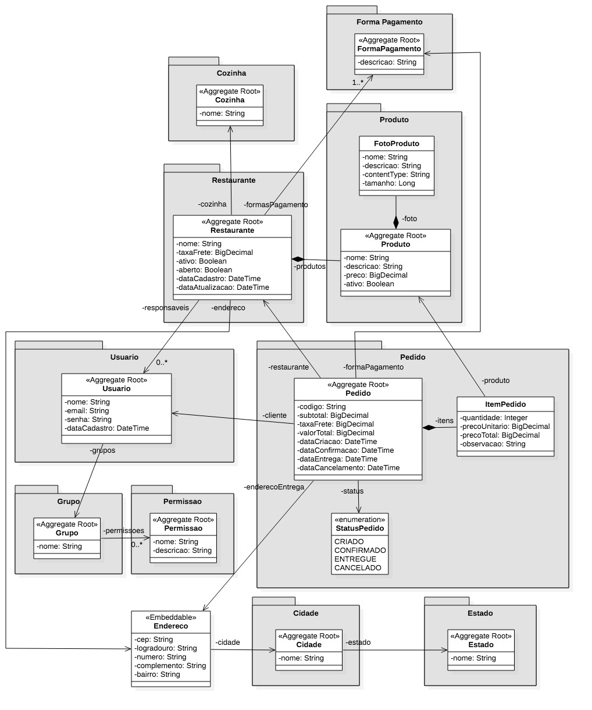

# Food Delivery API

A modern REST API for a food delivery platform, built with Java and Spring Boot.

> This project is being developed as a practical study in REST API design, domain modeling, persistence, security, testing, documentation and deployment, while revisiting and modernizing concepts from the **Especialista Spring REST** training by AlgaWorks for the current Java and Spring ecosystem.

## About the Project

**Food Delivery API** is a backend application that models the core operations of a food delivery platform.

The domain includes restaurants, kitchens, products, orders, customers, payment methods, addresses and access control.

The project has two complementary goals:

* build a complete REST API using production-oriented backend practices;
* revisit concepts from an extensive Spring REST training program and analyze how their implementation evolves when applied with the current Java and Spring ecosystem.

The original training contains approximately **90 hours, 630 lessons and 28 modules**. Since the material spans different generations of Spring — originally released in 2017 and later updated — this repository does not aim to simply reproduce its source code.

Instead, each relevant concept is studied, implemented, tested and, when necessary, modernized for the project's current stack.

---

## Technology Stack

The project currently uses or is planned to explore:

### Core

* Java 21
* Spring Boot 3.5.x
* Maven
* Spring Web

### Persistence

* Spring Data JPA
* Hibernate
* PostgreSQL
* Flyway
* Jakarta Persistence

### API

* Jakarta Bean Validation
* SpringDoc OpenAPI
* OpenAPI 3
* REST API design
* HATEOAS
* HTTP caching
* API versioning

### Security

* Spring Security
* OAuth 2.0
* JWT
* Spring Authorization Server

### Testing

* JUnit
* Spring Boot Test
* Integration Tests

### Infrastructure

* Docker
* Docker Compose
* Container-based deployment

> Technologies listed as planned are introduced incrementally as the corresponding concepts are reached during development.

---

## Domain Model

The application is based on a food delivery domain composed of several business concepts and aggregate roots.

Main domain concepts include:

* Kitchen
* Restaurant
* Product
* Product Photo
* Payment Method
* Order
* Order Item
* Order Status
* User
* Group
* Permission
* Address
* City
* State

The original domain model used as the starting reference is available below.



The model may evolve throughout development as architectural decisions and modern API practices are applied.

---

## Development Strategy

Development is incremental.

Rather than treating each course lesson as an isolated implementation task, commits represent cohesive technical changes to the application.

Examples:

```text
chore: bootstrap food delivery API project
feat: add kitchen domain model
feat: add restaurant persistence mapping
feat: expose kitchen REST resources
test: add kitchen API integration tests
refactor: migrate legacy API documentation to SpringDoc
```

This makes the Git history itself part of the project's technical documentation.

---

## Modernization Strategy

One of the central goals of this repository is to document the evolution between older Spring approaches and their current equivalents.

Examples that may appear throughout the project include:

| Earlier approach                     | Current project direction                           |
| ------------------------------------ | --------------------------------------------------- |
| `javax.*` APIs                       | `jakarta.*` APIs                                    |
| Older Java versions                  | Java 21                                             |
| Older Spring Boot generations        | Spring Boot 3.5.x                                   |
| SpringFox / Swagger integrations     | SpringDoc + OpenAPI 3                               |
| Legacy Spring Security configuration | Component-based `SecurityFilterChain` configuration |
| Older OAuth infrastructure           | Spring Authorization Server                         |
| Manual environment assumptions       | Reproducible container-based environments           |

The exact migration decisions are documented only when they are encountered and validated during implementation.

See [Modernization Notes](docs/modernization-notes.md).

---

## Learning Roadmap

The original training is organized into 28 modules covering the evolution from Spring fundamentals to security, containers and Spring Boot 3.

Instead of reproducing the training material, this project uses those modules as a technical roadmap.

Progress, implementation decisions and related commits are tracked in:

[Learning Roadmap](docs/learning-roadmap.md)

---

## Project Structure

The structure will evolve incrementally as new application responsibilities are introduced.

```text
food-delivery-api/
├── docs/
│   ├── architecture/
│   │   └── domain-model.jpg
│   ├── learning-roadmap.md
│   └── modernization-notes.md
├── src/
│   ├── main/
│   │   ├── java/
│   │   └── resources/
│   └── test/
├── .mvn/
├── .gitattributes
├── .gitignore
├── mvnw
├── mvnw.cmd
├── pom.xml
└── README.md
```

---

## Running the Project

The project uses the Maven Wrapper, allowing the build to run without relying on a specific globally installed Maven version.

### Requirements

* Java 21
* Docker / Docker Compose when infrastructure services are introduced

### Windows

```bash
mvnw.cmd clean verify
```

### Linux / macOS

```bash
./mvnw clean verify
```

Application startup and infrastructure instructions will be expanded as database and container configuration are introduced.

---

## Documentation

Project documentation is intentionally separated by responsibility:

* **README.md** — project overview and entry point;
* **learning-roadmap.md** — progress through the technical learning path;
* **modernization-notes.md** — legacy-to-modern implementation decisions;
* **architecture/** — diagrams and architectural documentation.

---

## Project Status

🚧 **Under active development**

The project is being implemented incrementally. Features, tests, documentation and infrastructure will evolve together throughout the study.

---

## Author

**Harlan Goyana**

Java Backend Developer focused on Spring Boot, REST APIs, software architecture and backend engineering.

GitHub: `https://github.com/hvalmer`
